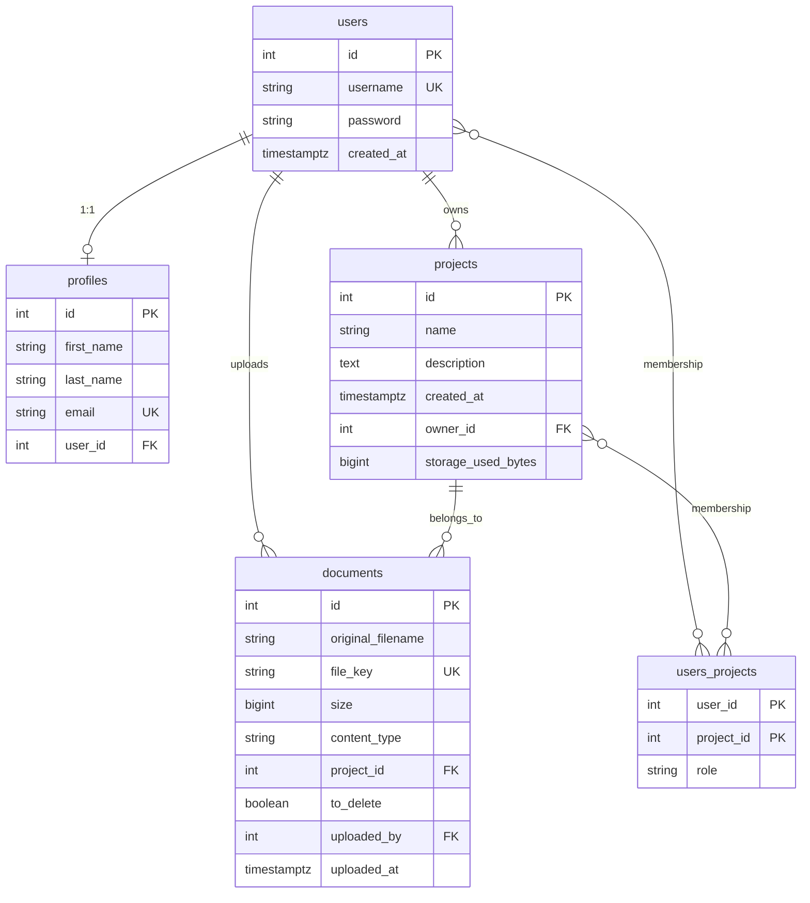

ProTrack - Project Management App

A backend project management service that allows users to create, update, share, and delete project information, including details and attached documents. It is built with FastAPI and PostgreSQL. Documents can be stored either locally or in AWS S3, depending on project needs.

## Table of Contents

- [Features](#features)
- [Implementation details](#implementation-details)
- [Installation](#installation)
- [Running](#running)
- [Configuration](#configuration)
- [Tech Stack](#tech-stack)
- [Database structure](#database-structure)
- [How the project can be upgraded](#how-the-project-can-be-upgraded)

## Features

- User authentication (login and registration).
- Create projects.
- Update project details (name and description).
- Retrieve project information for owners and participants.
- Manage project documents (upload, update, delete: DOCX, PDF).
- Manage project participation.
- Delete projects.
- Store documents locally or in AWS S3.

## Implementation details

HTTP routes are grouped by topic below. Path parameters are shown in angle brackets (for example, `<project_id>`).

### Authentication


| Method | Path             | Description                                       |
| ------ | ---------------- | ------------------------------------------------- |
| `POST` | `/auth/register` | Create a user (login, password, repeat password). |
| `POST` | `/auth/login`    | Log in (login, password).                         |


### Projects


| Method   | Path                               | Description                                                                  |
| -------- | ---------------------------------- | ---------------------------------------------------------------------------- |
| `POST`   | `/projects`                        | Create a project (name, description). Grants access to the creator as owner. |
| `GET`    | `/projects/<project_id>`           | Return project details if the caller has access.                             |
| `PUT`    | `/projects/<project_id>`           | Update name and description; returns the updated project.                    |
| `DELETE` | `/projects/<project_id>`           | Delete the project (owner only); removes associated documents.               |
| `GET`    | `/projects/<project_id>/documents` | List all documents for the project.                                          |
| `POST`   | `/projects/<project_id>/documents` | Upload one or more documents for the project.                                |


### Documents


| Method   | Path                       | Description                                              |
| -------- | -------------------------- | -------------------------------------------------------- |
| `GET`    | `/documents/<document_id>` | Download the file if the user has access to the project. |
| `PUT`    | `/documents/<document_id>` | Update document metadata or file.                        |
| `DELETE` | `/documents/<document_id>` | Delete the document and remove it from the project.      |


### Participation


| Method   | Path                                          | Description                                                                  |
| -------- | --------------------------------------------- | ---------------------------------------------------------------------------- |
| `POST`   | `/projects/<project_id>/invite?user=<login>`  | Grant project access to a user. Fails if the caller is not the owner.        |
| `DELETE` | `/projects/<project_id>/exclude?user=<login>` | Revoke that user’s access to the project.                                    |
| `GET`    | `/projects/<project_id>/share?with=<email>`   | Build a join link (hashed token) for the project to send to the given email. |


### Profile


| Method | Path                       | Description                                                |
| ------ | -------------------------- | ---------------------------------------------------------- |
| `POST` | `/users/<user_id>/profile` | Create or update the user’s profile (contact information). |
| `GET`  | `/users/<user_id>/profile` | Return the user’s profile.                                 |


## Installation

1. All project dependencies are listed in the `requirements.txt` file.
2. Installation steps:

2.1 Clone the repository:

```bash
git clone <repo-url>
cd <project-folder>
```

2.2 Create and activate a virtual environment:

```bash
python -m venv venv
source venv/bin/activate  # on Linux/Mac
venv\Scripts\activate     # on Windows
```

2.3 Install dependencies:

```bash
pip install -r requirements.txt
```

2.4 Create a `.env` file and set the environment variables described under [Configuration](#configuration).

## Running

Start the development server (adjust the module path if your app package differs):

```bash
uvicorn app.main:app --reload
```

## Configuration

Do not commit real secrets. Keep credentials in a local `.env` file (ignored by Git) and use your hosting platform’s secret or environment configuration in production.

Required environment variables:

**Database connection**

- `DATABASE_HOSTNAME=...`
- `DATABASE_PORT=...`
- `DATABASE_USERNAME=...`
- `DATABASE_PASSWORD=...`
- `DATABASE_NAME=...`

**JWT authorization**

- `SECRET_KEY=...`
- `ALGORITHM=...`
- `ACCESS_TOKEN_EXPIRE_MINUTES=...`

**Invitation JWT**

- `INVITE_SECRET_KEY=...`
- `INVITE_ALGORITHM=...`
- `INVITE_ACCESS_TOKEN_EXPIRE_MINUTES=...`

**Document storage**

- `UPLOAD_DIR=...`
- `USE_S3=true` or `false`
- `S3_BUCKET=...`
- `AWS_ACCESS_KEY_ID=...`
- `AWS_SECRET_ACCESS_KEY=...`
- `AWS_REGION=...`

## Tech Stack

- **Backend:** FastAPI
- **API documentation:** OpenAPI (Swagger UI)
- **Database:** PostgreSQL
- **Infrastructure / storage:** AWS S3

## Database structure

The schema is implemented in PostgreSQL. This section gives an entity–relationship overview and explains how the tables connect.

### Relations overview




### Relationship summary

- **User ↔ Profile:** one-to-one (`profiles.user_id` unique, FK to `users.id`).
- **User ↔ Project (ownership):** one-to-many (`projects.owner_id` → `users.id`). Owner may be cleared if the user is removed (`SET NULL`).
- **User ↔ Project (access):** many-to-many via the `**users_projects`** table, with composite primary key `(user_id, project_id)` and `role`.
- **User ↔ Document:** one-to-many (`documents.uploaded_by` → `users.id`); identifies who uploaded each file.
- **Project ↔ Document:** one-to-many (`documents.project_id` → `projects.id`); `project_id` is nullable in the model.

## How the project can be upgraded

Possible next steps to evolve the codebase without changing the core product idea:

### 1. Add DTOs

Introduce **data transfer objects** (Pydantic models or dedicated schemas) as the public contract for API input and output, separate from SQLAlchemy models. That keeps persistence details out of route handlers, makes validation explicit, and simplifies versioning or field renames later. Apply DTOs for request bodies, responses or list wrappers where needed.

### 2. Log business actions

Add **structured logging** around domain operations (for example, project created, document uploaded, member invited, ownership changed). Log who performed the action, on which resource, and a short outcome or error code. Use consistent log levels and message shapes so operations teams can audit behavior and debug issues without turning on raw SQL traces.

### 3. Log database queries

Enable SQLAlchemy query logging in development (e.g. using engine.echo or logging for sqlalchemy.engine) to help debug queries. In staging, you can route queries through logging to investigate performance issues. 
